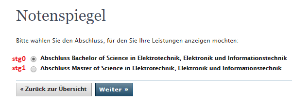

# MeinCampusCrawler  
**What?**  
A script to check for new exam results on [mein Campus](https://www.campus.uni-erlangen.de).  

**Why?**  
[Because I should be studying right now](https://en.wikipedia.org/wiki/Procrastination).  

**How?**  
This python script launches a browser and navigates to the table of results. It than checks if the table differs from the last time it checked and if so, it'll send an email with the delta to your mail address.

**What do I need?**
* Preferably a Raspberry Pi. Because of it's cross-platform functionality, the python script should work on Windows as well (with minor changes) but it hasn't been tested.
* Two mail addresses: one is used to send a notification and the one you want to receive the notification.

**How to use:**
1. Install Python  
The script was written and tested with Python 3.7.4  
`sudo apt-get install python3`

2. Install the following packages:  
`pip3 install selenium`  
`pip3 install pyvirtualdisplay`  
`sudo apt-get install xserver-xephyr`  
`sudo apt-get install xvfb x11vnc daemon`

3. Choose a Browser and download the corresponding webdriver  
**Firefox:** download [geckodriver](https://github.com/mozilla/geckodriver/releases) and save it to the same directory as the script.  
**Chromium (Raspbian):** To be tested.  
**Other browsers** haven't been tested but might work as well.  
If it isn't, you have to make the driver executable:  
`chmod +x PATH_TO_YOUR_WEBDRIVER`

4. Change the variables to your needs.  
There are several variables that you want to edit:  
* Your credentials/email details
  * you need to enter your SSO credentials
  * you need to enter the credentials of the mailserver  
  **Your credentials are stored in plain text in this script. Be aware of this!**
* Choose your course of study  
If you are or have been enlisted in more then one course of study you have to choose which one you want to check. To specify which one you want, you must edit the variable studienGang to either stg0 or stg1 (see image).  

5. Arrange recurring execution  
**Windows:** Use task schedueler.  
**Linux/Raspbian:** Use crontab:  
* You need to specify how often the script should be executed. There are [crontab generators](https://crontab-generator.org/) you can use.
* The cronjob includes three commands, seperated by *&&*
  * For some reason you have to navigate to the script's folder first  
  `cd /PATH/TO/SCRIPT/`
  * Because crontab's PATH variable is a mysterium to me you have to explicitly add the path of the webdriver to the job: `export PATH=$PATH:/PATH/TO/WEBDRIVER` Note: I encountered problems, when the webdriver was not located in the same directoy as the script.
  * execute the actual script `/usr/bin/python3/ /PATH/TO/SCRIPT/campusCrawler.py`
* open the crontab
`crontab -e`
* Add your cronjob to the end of the file.
Here is an example which executes the script every 15 minutes:  
`*/15 * * * * cd /home/pi/mnt/ && export PATH=$PATH:/home/pi/mnt/ && /usr/bin/python3 /home/pi/mnt/campusCrawler.py`

